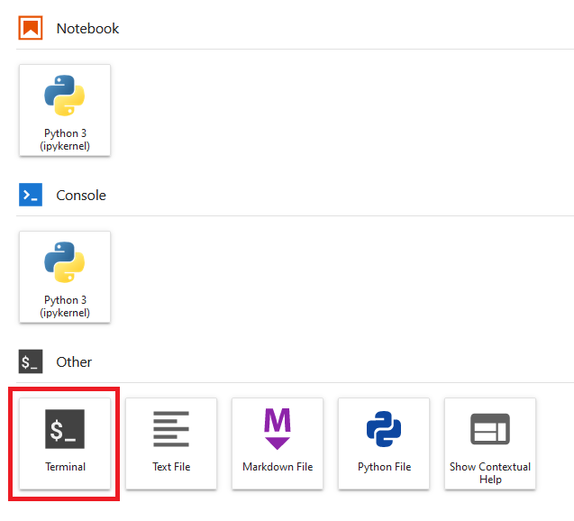
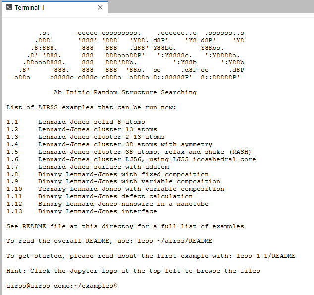

AIRSS Demostration
------------------

This repository defines a binder environment for running interactive demonstrations for Ab-initio Random Structure Searching.
Click the badge above to launch a cloud hosted Jupyter notebook environment with AIRSS pre-installed. 
You can explore the examples and see the structure searching in action.

Note
----
Press the terminal symbol to launch a terminal. Some basic knowledge of Linux command line (bash) is needed to run the samples.

Please allow up to to 1 minute for the server to start. If no pre-built image is avaliable, it may take up to 5 minutes for the initial building process.
